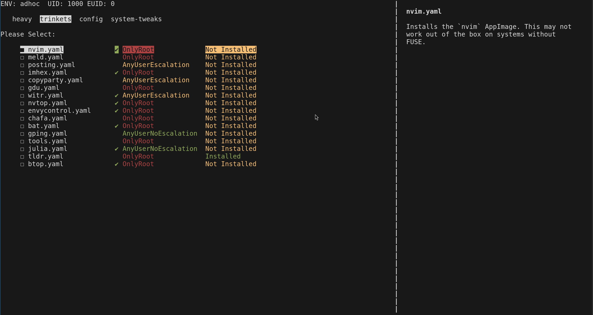

# expand
TUI for running ansible files with dependencies. Supports configs per-user, root/user-only powers in ansible files, smart system compatibility, and live URL checking. Born from a need to re-install my entire linux system just the way I like it in a few minutes. This is also where all my config files and custom scripts live, which I use on a daily basis. 

## Running
Run `. activate.sh` or `. activate.fish` then run `python3 -m expand` to install stuff for root. For a user, do `python3 -m expand --user=[user]`. 
